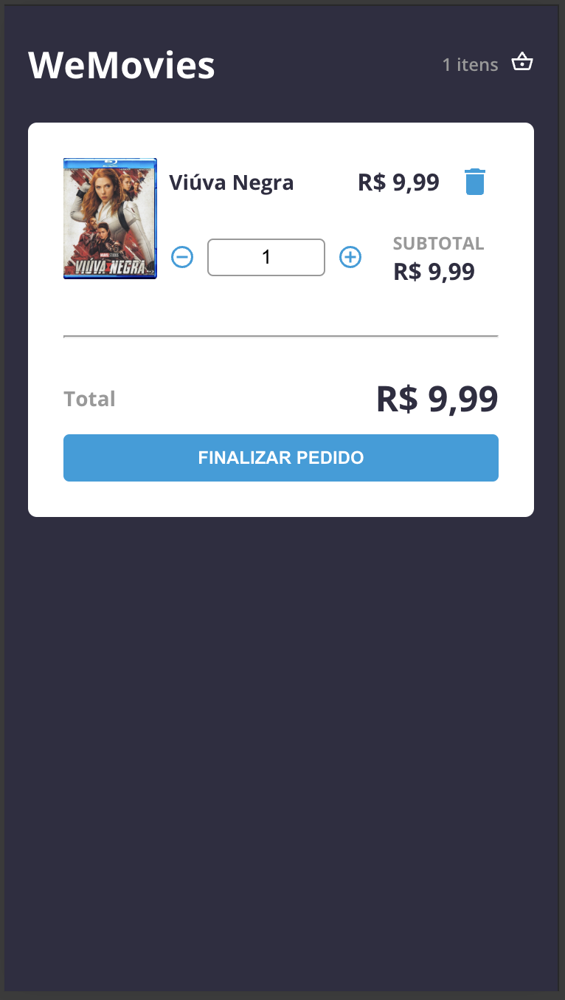

# WeMovies: Encontre e compre os melhores e mais novos filmes do cinema

WeMovies é um web app para comprar filmes, construído com React, projetado para oferecer uma experiência perfeita para entusiastas do cinema.


## Demo


Layout responsivo baseado no dispositivo utilizado:



## Features
- [x] Lista de produtos
- [x] Carrinho de compras
- [x] Página de pedido concluído

## Tecnologias Utilizadas

Este projeto foi construído com as seguintes tecnologias:

- **React.js**: Uma biblioteca JavaScript para construir interfaces de usuário.
- **Styled-components**: Um framework CSS in JS para estilização rápida e responsiva.
- **ESLint**: Ferramenta de linting para identificar e reportar padrões encontrados no código ECMAScript/JavaScript.
- **Vitest**: Um framework de testes JavaScript.

## Ambiente de desenvolvimento

### Pré-requisitos

Certifique-se de ter **Node.js** versão mínima v18 e **yarn** instalados em seu sistema.

Dica: Utilize `nvm` para utilizar a versão recomendada de cada app. Saiba mais em [Github NVM](https://github.com/nvm-sh/nvm)

### Getting Started

Primeiro, altere as variáveis de ambiente:

Crie uma copia do `.env` e renomeie para `.env.local`:
```bash
cp .env .env.local
```
Modifique as variáveis para conteúdo semelhante ao abaixo:
```sh
VITE_API_URL=http://localhost:3333
```

Rode o servidor mockado da API

```sh
yarn mockapi:start
```

Agora, poderá rodar o servidor de desenvolvimento do frontend:

```bash
yarn dev
```

Abra [http://localhost:3000](http://localhost:3000) no browser de sua preferência e veja a carinha do app.

E agora você pode começar a codar nos arquivos encontrados dentro da pasta `src/`, e fora desta pasta, encontra-se os arquivos de configuração e testes.

### Testes
Este projeto utiliza Vitest para testes. Para executar os testes, siga estes passos:

Execute o comando para iniciar os testes:

```bash
yarn test
```

Veja mais detalhes nos arquivos da pasta `src/tests`
